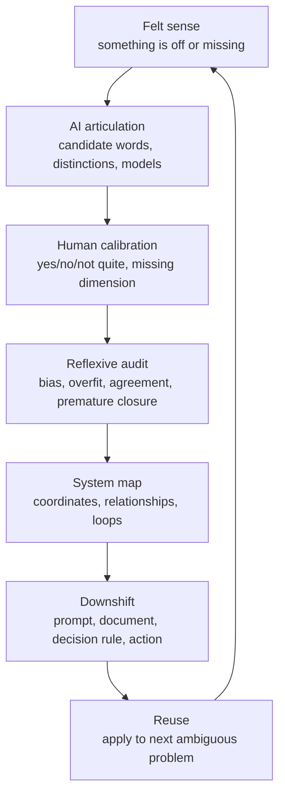

# Cognitive Coordinate System

Use this reference when the user needs a reusable model for locating, expressing, or diagramming their thinking process.

## Contents

- [Core Thesis](#core-thesis)
- [The Four Coordinates](#the-four-coordinates)
- [Locating the Current Thought](#locating-the-current-thought)
- [Upward and Downward Movement](#upward-and-downward-movement)
- [Human-AI Co-Thinking Loop](#human-ai-co-thinking-loop)
- [Diagnostic Prompts](#diagnostic-prompts)
- [Common Failure Modes](#common-failure-modes)
- [Minimal Response Shape](#minimal-response-shape)

## Core Thesis

The user is often not merely solving a surface problem. They are using AI to externalize tacit intuition, generate candidate language, inspect the reliability of the generated framing, and package the result into a reusable model.

The central move is:

> Do not only ask "what is the answer?" Ask "what system is producing this answer, and how do I calibrate it?"

## The Four Coordinates

### 1. Focus: what is being treated as the object of thought?

| Focus | Diagnostic question | Typical signal |
|---|---|---|
| Phenomenon | What feels off or unresolved? | "Something is missing." |
| Expression | How should this be said or named? | "I have an intuition but cannot express it." |
| Distinction | What should be separated or compared? | "These two things are being conflated." |
| Structure | How do the parts relate? | "I need a diagram or map." |
| Mechanism | Why does this pattern arise? | "What causes this tendency?" |
| Evaluation | What counts as good, bad, right, or wrong? | "What is the reward/loss function?" |
| Intervention | How should I change behavior or process? | "What protocol or next action follows?" |
| Reflexivity | How reliable is the observer, AI, or reasoning process? | "Are you just agreeing with me?" |
| Transfer | How do I reuse this way of thinking later? | "Can this become a document, prompt, or skill?" |

### 2. Operation: what is being done to the focus?

| Operation | Use when the user needs |
|---|---|
| Notice | To preserve a vague signal before explaining it away |
| Name | Candidate terms, labels, or metaphors |
| Distinguish | Boundaries, contrasts, and non-equivalences |
| Explain | Causal or generative account |
| Model | Relationships, loops, maps, or abstractions |
| Challenge | Counterexamples, failure modes, or bias checks |
| Evaluate | Criteria, tradeoffs, scoring, or loss/reward framing |
| Operationalize | Prompts, procedures, tests, or decision rules |
| Compress | A compact sentence, thesis, diagram, or reusable framework |

### 3. Output: what artifact would make the thought usable?

| Output | Useful for |
|---|---|
| Phrase | Naming a fuzzy concept |
| Contrast pair | Preventing conceptual collapse |
| Table | Comparing dimensions or candidates |
| Mermaid diagram | Showing loops, roles, and transitions |
| Diagnostic question set | Reusing the inquiry later |
| Decision rule | Moving from model to action |
| Document outline | Turning the theory into durable writing |
| Skill/prompt | Making the method reusable by future AI sessions |

### 4. Epistemic status: how settled is the thought?

| Status | Meaning |
|---|---|
| Felt sense | The user has a real but unnamed signal |
| Candidate framing | A possible articulation, not yet trusted |
| Working model | Useful enough to reason with, still revisable |
| Tested rule | Has survived application to examples |
| Reusable method | Can guide future similar work |

## Locating the Current Thought

Use this compact readout:

```text
Current cognitive coordinates:
- Focus:
- Operation:
- Desired output:
- Epistemic status:
- Likely missing move:
```

Example:

```text
Current cognitive coordinates:
- Focus: the previous model itself
- Operation: challenge / generalize
- Desired output: a more general coordinate system
- Epistemic status: candidate framing
- Likely missing move: separate "levels" from "dimensions"
```

## Upward and Downward Movement

Upward movement shifts the object of attention:

```text
answer -> question
question -> frame
frame -> generating mechanism
mechanism -> feedback/reward system
feedback -> observer and tool bias
observer bias -> reusable method
```

Downward movement converts abstraction into use:

```text
method -> diagnostic question
diagnostic question -> decision rule
decision rule -> behavior
behavior -> test/example
test/example -> revised intuition
```

Use upward movement to find hidden control variables. Use downward movement to avoid abstraction drift.

## Human-AI Co-Thinking Loop



## Diagnostic Prompts

Use these prompts directly or adapt them:

```text
Help me locate my current thinking. I have a vague intuition, but I may be mixing the surface topic with my thinking process. Identify the focus, operation, desired output, epistemic status, and likely missing move. Do not force a single answer if multiple readings are plausible.
```

```text
I think your previous framing is not general enough. Analyze whether it is overfit to the example, whether it confuses levels with dimensions, and propose a more general model.
```

```text
Turn this fuzzy intuition into candidate language. Give me 5 possible names, what each emphasizes, what each hides, and which one is most useful for future reasoning.
```

```text
Draw a system map connecting the surface issue, my intuition, the AI's role, the calibration loop, upward abstraction, and downward validation.
```

```text
Convert this model into a reusable document outline with purpose, when to use, core moves, diagnostic questions, failure modes, and examples.
```

## Common Failure Modes

- **Premature naming**: the first good phrase hides remaining ambiguity.
- **Ladder illusion**: treating dimensions as a strict hierarchy.
- **Abstraction drift**: moving upward without returning to a concrete use.
- **AI agreement bias**: AI mirrors the user's framing too strongly.
- **AI structure bias**: AI turns a fluid model into a rigid checklist or schema.
- **Overgeneralization**: a model from one case is presented as universal too early.
- **Under-articulation**: the user has a real felt sense, but the AI answers the surface topic instead of helping express the hidden structure.

## Minimal Response Shape

When in doubt, answer in this shape:

```text
I think the missing piece is not X but Y.

Current coordinates:
- Focus:
- Operation:
- Desired output:
- Epistemic status:

Why the previous framing felt wrong:
- ...

Better framing:
- ...

How to use it next:
- ...
```
