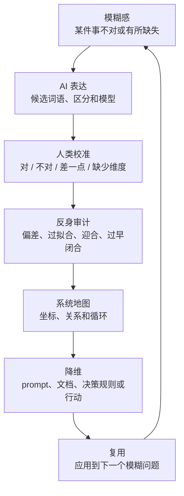

# 认知坐标系统

当用户需要一个可复用的模型来定位、表达或描绘自己的思考过程时，使用这份 reference。

## 目录

- [核心命题](#核心命题)
- [四个坐标](#四个坐标)
- [定位当前思考](#定位当前思考)
- [升维与降维移动](#升维与降维移动)
- [Human-AI 共思循环](#human-ai-共思循环)
- [诊断提示](#诊断提示)
- [常见失败模式](#常见失败模式)
- [最小回答形态](#最小回答形态)

## 核心命题

用户往往不只是在解决一个表层问题。他们也在借助 AI 外化隐性直觉、生成候选语言、检查这些表达是否可靠，并把结果整理成可复用的模型。

核心动作是：

> 不要只问“答案是什么”，还要问“什么系统正在生成这个答案，我应该如何校准它”。

## 四个坐标

### 1. 焦点：当前把什么当作思考对象？

| 焦点 | 诊断问题 | 典型信号 |
|---|---|---|
| 现象 | 什么地方让人觉得不对或没有完成？ | “好像少了什么。” |
| 表达 | 这件事应该怎样说或怎样命名？ | “我有感觉，但表达不出来。” |
| 区分 | 哪些东西需要被分开或比较？ | “这两件事被混在了一起。” |
| 结构 | 各部分之间是什么关系？ | “我需要一张图或一份地图。” |
| 机制 | 这种模式为什么会出现？ | “是什么导致了这种倾向？” |
| 评估 | 什么算好、坏、对或错？ | “这里的奖励或损失函数是什么？” |
| 干预 | 应该如何改变行为或过程？ | “接下来应该采用什么规则或行动？” |
| 反身性 | 观察者、AI 或推理过程可靠吗？ | “你是不是只是在顺着我？” |
| 迁移 | 以后如何复用这种思考方式？ | “它能否成为文档、prompt 或 skill？” |

### 2. 操作：正在对焦点做什么？

| 操作 | 用户需要什么时使用 |
|---|---|
| 注意 | 在解释掉模糊信号之前先保留它 |
| 命名 | 生成候选术语、标签或隐喻 |
| 区分 | 找到边界、对比和不等价关系 |
| 解释 | 提供因果或生成机制 |
| 建模 | 建立关系、循环、地图或抽象 |
| 质疑 | 寻找反例、失败模式或偏差 |
| 评估 | 建立标准、权衡、评分或奖励/损失框架 |
| 操作化 | 生成 prompt、流程、测试或决策规则 |
| 压缩 | 形成一句话、命题、图示或可复用框架 |

### 3. 输出：什么产物能让这段思考变得可用？

| 输出 | 用途 |
|---|---|
| 短语 | 命名一个模糊概念 |
| 对比组 | 防止概念塌缩 |
| 表格 | 比较维度或候选方案 |
| Mermaid 图 | 展示循环、角色和转变 |
| 诊断问题集 | 以后重复使用同一种追问 |
| 决策规则 | 从模型回到行动 |
| 文档提纲 | 把理论沉淀成可持续发展的文字 |
| Skill / prompt | 让未来的 AI 会话复用这种方法 |

### 4. 认识状态：这段思考有多稳定？

| 状态 | 含义 |
|---|---|
| 模糊感 | 用户已经有一个真实但尚未命名的信号 |
| 候选表达 | 一种可能的说法，但还没有被信任 |
| 工作模型 | 已足以辅助思考，但仍可修改 |
| 经验证规则 | 已经在一些案例中经受住检验 |
| 可复用方法 | 可以指导未来的类似工作 |

## 定位当前思考

使用这个简洁读数：

```text
当前认知坐标：
- 焦点：
- 操作：
- 期望输出：
- 认识状态：
- 可能缺少的动作：
```

示例：

```text
当前认知坐标：
- 焦点：之前的模型本身
- 操作：质疑 / 泛化
- 期望输出：更通用的坐标系统
- 认识状态：候选表达
- 可能缺少的动作：把“层级”和“维度”分开
```

## 升维与降维移动

升维移动会改变注意对象：

```text
答案 -> 问题
问题 -> 框架
框架 -> 生成机制
机制 -> 反馈 / 奖励系统
反馈 -> 观察者和工具偏差
观察者偏差 -> 可复用方法
```

降维移动把抽象重新转成使用：

```text
方法 -> 诊断问题
诊断问题 -> 决策规则
决策规则 -> 行为
行为 -> 测试 / 案例
测试 / 案例 -> 修正后的直觉
```

使用升维移动寻找隐藏的控制变量，使用降维移动防止抽象漂移。

## Human-AI 共思循环



## 诊断提示

直接使用或按需要调整这些 prompt：

```text
帮我定位当前的思考。我有一种模糊感，但可能把表层话题和自己的思考过程混在了一起。请识别焦点、操作、期望输出、认识状态和可能缺少的动作。如果有多种合理理解，不要强行给出唯一答案。
```

```text
我觉得你之前的表达不够通用。请分析它是否过拟合当前案例，是否混淆了层级和维度，并提出一个更通用的模型。
```

```text
把这个模糊直觉转成候选语言。给出五个可能的名称，说明每个名称强调了什么、遮蔽了什么，以及哪一个最适合后续思考。
```

```text
画一张系统图，连接表层问题、我的直觉、AI 的作用、校准循环、向上抽象和向下验证。
```

```text
把这个模型转成可复用的文档提纲，包括目的、使用时机、核心动作、诊断问题、失败模式和例子。
```

## 常见失败模式

- **过早命名：** 第一个听起来不错的短语遮住了尚未解决的模糊处。
- **阶梯幻觉：** 把不同维度误认为严格的上下层级。
- **抽象漂移：** 一直向上抽象，却没有回到具体用途。
- **AI 迎合偏差：** AI 过度映照用户已有的框架。
- **AI 结构偏差：** AI 把流动模型变成僵硬的 checklist 或 schema。
- **过度泛化：** 从一个案例得到的模型被过早描述成普遍规律。
- **表达不足：** 用户已有真实模糊感，但 AI 只回答表层问题，没有帮助显化隐藏结构。

## 最小回答形态

不确定如何回答时，使用这个形态：

```text
我认为缺少的可能不是 X，而是 Y。

当前坐标：
- 焦点：
- 操作：
- 期望输出：
- 认识状态：

之前的表达为什么让人觉得不对：
- ...

更合适的候选表达：
- ...

下一步如何使用或验证：
- ...
```
